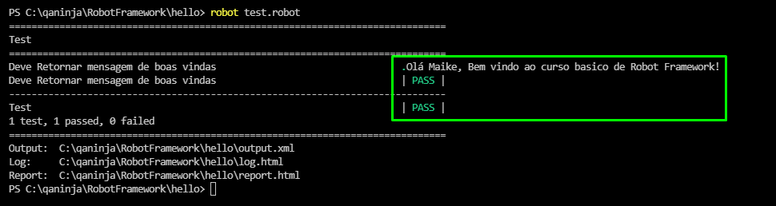

# Robot FrameWork/ Selenium

## Tecnologias utilizadas
- Python (https://www.python.org/downloads/)
- VSCODE (https://code.visualstudio.com/)
- RobotFrameWork (https://robotframework.org/)
- Selenium WebDriver (https://selenium-python.readthedocs.io/)
  
  
### Primeira etapa
Efetua as instalações do Python e Robot Framework

<b>Python</b> => efetuar o download no site do python do útlimo release => Executar o instaldos => com o instalador aberto, seleciona a opção Instalação customizada e marcar a opção para adicionar as variáveis do Windows

=> na próxima tela marcar a opção Install for All Users

<b>vscode</b> => instalar o vscode e a extensoes do python e robotframework 

<b>RobotFramework</b> 
=> No terminal do VSCODE criar o diretorio do trabalho <i>cd mkdir RobotFrameWork, cd RobotFramework</i> =>
=> abrir a pasta criada no VSCODE 
=> ainda no terminal <i>pip install robotframework</i>

### Iniciando com o RobotFramework

=> criar um arquvio no seu diretório <b>".py"</b>

primeiro projeto

`def welcome(name):
    return "Olá " + name + ", Bem vindo ao curso basico de Robot Framework"

result=welcome("Maike")
print (result)`

=> execute seu pojeto `python app.py`
=> criando arquivo robot test.robot
iportante lembrar que o RobotFramework é tabular

` *** Settings ***
  Library       app.py

  *** Tests Cases ***
  Retornar mensagem de boas vindas ao usuário

    Welcome     Maike `

=> executar o programa do robot `robot test.robot`

